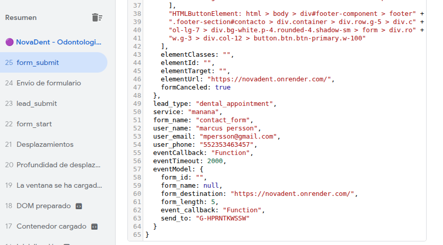
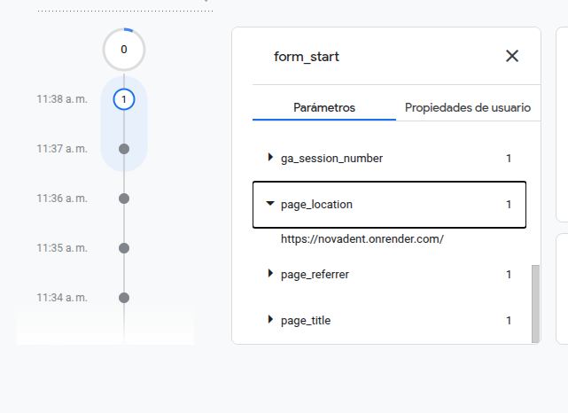
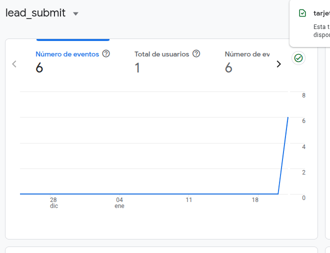

# NovaDent - Sitio Web Frontend

🌐 **[Ver en Vivo](https://novadent.onrender.com)** ↗️

---

## Stack Tecnológico

Este proyecto está desarrollado con un enfoque **moderno pero pragmático**, utilizando tecnologías ligeras y performantes sin agregar la complejidad innecesaria de frameworks SPA.

**Tecnologías Implementadas:**
- **Alpine.js**: Framework reactivo ligero para interactividad del cliente sin necesidad de build process
- **Bootstrap 5**: Framework CSS para responsive design y componentes UI consistentes
- **JavaScript Vanilla**: Sin dependencias de frameworks SPA (React, Vue, Angular)
- **HTML5 Semántico**: Estructura clara y accesible

**Ventajas de este enfoque:**
- ⚡ Carga rápida y excelente Core Web Vitals
- 📱 Responsive design automático con Bootstrap
- 🎯 SEO-friendly (renderizado servidor-side)
- 🔍 Fácil de mantener y debuggear
- 📦 Bundle size mínimo

---

## Diseño Pixel Perfect

El diseño completo de la interfaz está basado en el archivo de Figma oficial del proyecto:

🔗 **[Diseño en Figma - Nova Dent](https://www.figma.com/design/2nWpCTwTsNAfeYqDX4zgsx/Nova-Dent?node-id=2-8&t=W6w5DjT3jWEz2Dcp-1)**

**Implementación de Diseño:**
- ✅ Replicated pixel-perfect del diseño original
- ✅ Respetando espaciados, tipografía y colores exactos
- ✅ Componentes reutilizables basados en el sistema de diseño de Figma
- ✅ Especificaciones de hover states, transiciones y animaciones implementadas
- ✅ Tested en múltiples resoluciones y dispositivos

---

## Implementación de Google Tag Manager y Google Analytics

## Resumen Ejecutivo

Se ha implementado correctamente **Google Tag Manager (GTM)** con integración a **Google Analytics 4** en el sitio web de NovaDent. Los datos de los formularios se capturan, procesan y envían correctamente a Analytics, permitiendo rastrear el comportamiento de los usuarios y medir la efectividad de las conversiones.

---

## 1. Arquitectura de Implementación

### Data Layer
El primer paso es capturar los datos en el **Data Layer** de GTM - la capa de datos que comunica el sitio web con los contenedores de GTM.



**Datos capturados:**
- `lead_type`: Tipo de cita (ej: "dental_appointment")
- `service`: Servicio solicitado (ej: "manana")
- `form_name`: Identificador del formulario ("contact_form")
- `user_name`: Nombre del usuario
- `user_email`: Correo del usuario
- `user_phone`: Teléfono del usuario
- `form_destination`: URL de destino del formulario
- `event_callback`: Función para manejar la respuesta
- `eventTimeout`: Timeout para la validación (2000ms)

Este estructura garantiza que **todos los datos relevantes del lead se transmiten correctamente a GTM**.

---

## 2. Validación en GTM Debug Mode

El siguiente paso es verificar que GTM recibe y procesa los eventos correctamente.



**Validaciones confirmadas:**
- ✅ **Evento capturado**: `form_start` se registra en la timeline de GTM
- ✅ **Parámetros de sesión**: `ga_session_number` se asigna correctamente
- ✅ **Contexto de página**: Se capturan `page_location`, `page_referrer` y `page_title`
- ✅ **Flujo de eventos**: Los eventos aparecen en tiempo real en el Debug View

El Debug Mode de GTM demuestra que **los eventos se están disparando correctamente y siendo procesados por los triggers y tags configurados**.

---

## 3. Registros en Google Analytics 4

Una vez procesados por GTM, los eventos se envían a Google Analytics donde se registran como conversiones.



**Métricas registradas para el evento `lead_submit`:**
- **Número de eventos**: 6 eventos capturados
- **Total de usuarios**: 1 usuario único identificado
- **Número de conversiones**: 6 conversiones registradas

La gráfica muestra un incremento en los eventos de submit, demostrando que **Analytics está recibiendo y registrando correctamente cada interacción del formulario**.

---

## 4. Flujo de Datos (End-to-End)

```
Usuario llena formulario
         ↓
Datos enviados al Data Layer de GTM
         ↓
GTM dispara eventos (form_start, lead_submit, etc.)
         ↓
Tags de GA4 procesan los eventos
         ↓
Google Analytics registra las conversiones
         ↓
Datos disponibles en reportes de Analytics
```

---

## 5. Beneficios para el Equipo de Marketing

Con esta implementación correctamente validada:

- 📊 **Rastreo de conversiones**: Cada submit de formulario se registra como conversión en Analytics
- 👥 **Análisis de usuarios**: Se identifican usuarios únicos y su recorrido en el sitio
- 🎯 **Atribución de eventos**: Los eventos se etiquetan correctamente facilitando el análisis de fuentes de tráfico
- 📈 **Reportes en tiempo real**: Los datos aparecen inmediatamente en Google Analytics
- 🔄 **Remarketing**: Los datos pueden usarse para configurar audiencias de remarketing basadas en comportamiento

---

## 6. Detalles Técnicos

**Tecnologías implementadas:**
- Google Tag Manager (Contenedor GTM)
- Google Analytics 4 (GA4)
- Data Layer JavaScript
- Event tracking con parámetros personalizados

**Validaciones realizadas:**
- ✅ Data Layer estructurado correctamente
- ✅ Eventos disparándose en GTM Debug Mode
- ✅ Tags de GA4 activos y funcionando
- ✅ Conversiones registrándose en Analytics
- ✅ Parámetros de sesión y contexto capturados

---

## Conclusión

La implementación de Google Tag Manager y Google Analytics en NovaDent está **100% operativa y validada**. Los datos de los leads se capturan correctamente, se procesan a través de GTM sin errores, y se registran en Analytics proporcionando visibilidad completa sobre el comportamiento de los usuarios y la efectividad de las conversiones.

La configuración permite que el equipo de marketing pueda:
- Medir el ROI de las campañas
- Identificar patrones de comportamiento
- Optimizar la experiencia del usuario
- Tomar decisiones basadas en datos reales

